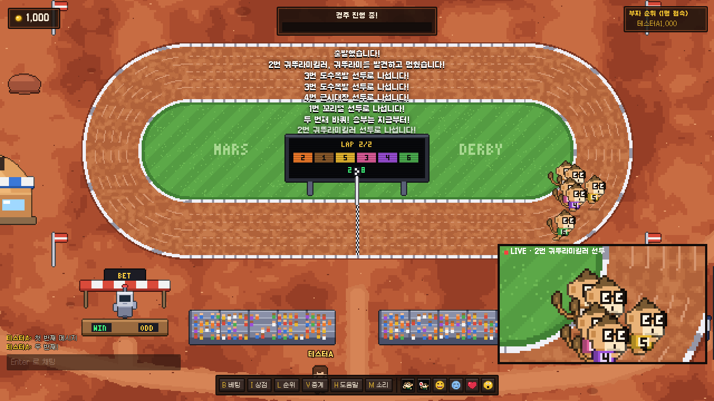
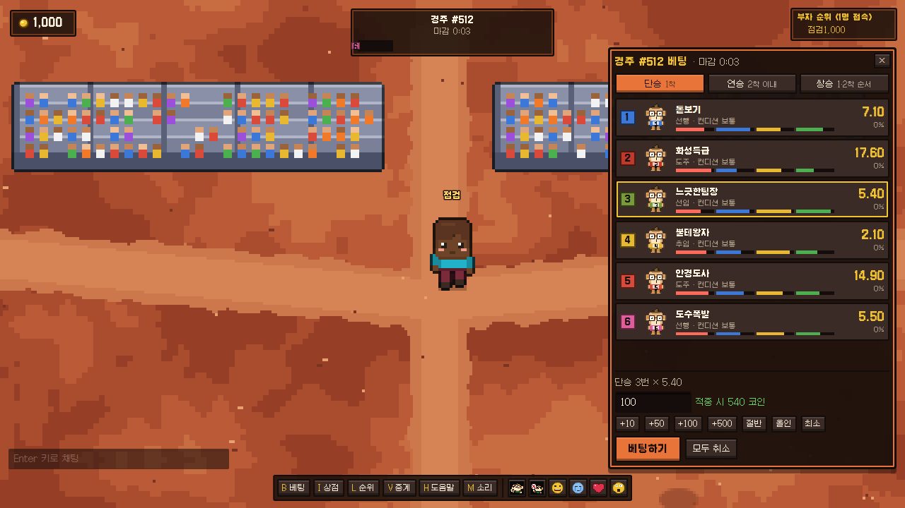
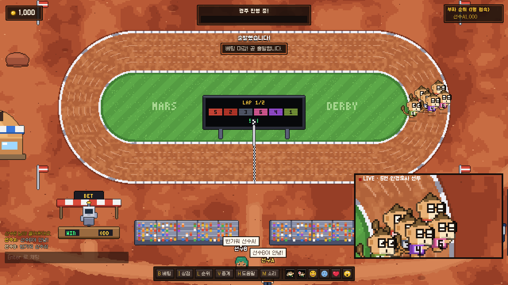
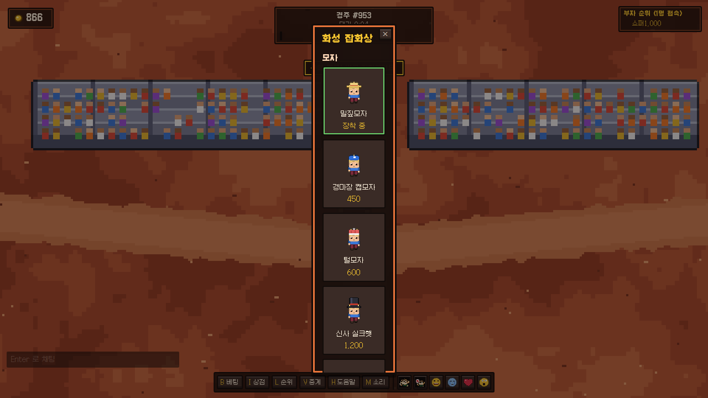

# 안경원숭이 더비 · 화성 경마장

화성 경마장에서 안경원숭이 여섯 마리의 경주에 코인을 거는 멀티플레이 브라우저 게임입니다.
픽셀아트는 모두 캔버스 코드로 그렸고, 돈·베팅·경주 결과는 전부 서버가 판정합니다.



| 베팅 | 채팅·멀티플레이 | 상점 |
| --- | --- | --- |
|  |  |  |

## 주요 기능

- **경주**: 5분마다 한 번 열립니다. 전광판, 실황 중계, 선두 클로즈업 화면이 나오고, 접전이면 슬로모션 사진 판정이 이어집니다.
- **베팅**: 단승(1착), 연승(2착 이내), 쌍승(1·2착 순서). 배당은 몬테카를로 시뮬레이션으로 계산합니다. 경주 결과는 베팅이 마감된 뒤에 정해지므로 서버도 미리 알 수 없습니다.
- **채팅**: 머리 위 말풍선과 채팅 로그, 이모트 6종. 서버에서 도배 제한, 같은 말 반복 차단, 비속어 가리기를 처리합니다.
- **상점**: 모자, 발자취 효과, 탈것(이동 속도 증가), 펫.
- **채굴**: 맵 양쪽의 바위를 곡괭이로 캐서 코인을 얻습니다. 4% 확률로 보석이 나옵니다.
- **파산 감옥**: 코인이 10개보다 적어지면 경기장 옆 감옥(안은 벼밭)에 갇히고 안경원숭이로 변합니다. 익은 벼를 베어 쌀 5개를 간수 로봇에게 팔면 풀려나고, 벨 때마다 5% 확률로 즉시 탈출합니다. 45초가 지나면 자동으로 풀려나며, 나올 때 재기 지원금 300코인을 받습니다.
- **재접속**: 브라우저에 저장된 토큰으로 코인과 아이템이 유지됩니다.

## 실행

Node.js 18 이상이 필요합니다.

```bash
npm install
npm start          # 빌드 후 http://localhost:8080
```

| 환경 변수 | 기본값 | 설명 |
| --- | --- | --- |
| `PORT` | `8080` | 포트 |
| `HOST` | `0.0.0.0` | 바인드 주소 |
| `CYCLE_MS` | `300000` | 경주 주기(ms). 테스트할 때는 `20000` 정도로 줄이면 편합니다 |
| `DATA_FILE` | `data/players.json` | 플레이어 데이터 저장 위치 |
| `TRUST_PROXY` | - | `1`이면 `X-Forwarded-For`로 IP를 판단합니다 (리버스 프록시 뒤에서 사용) |
| `ALLOWED_ORIGINS` | - | 추가로 허용할 WebSocket Origin (쉼표로 구분) |
| `MAX_PER_IP` / `MAX_CONN` | `60` / `300` | IP당·전체 동시 접속 제한 (같은 공유기·강의실 사용자 고려) |

### 친구 초대 (인터넷 공개)

```bash
npm run share
```

게임 서버와 Cloudflare 임시 터널을 함께 띄우고 `https://xxxx.trycloudflare.com` 주소를 출력합니다. 계정·공유기 설정이 필요 없고, 처음 실행하면 `cloudflared`를 `~/.local/bin`에 내려받습니다. 주소가 실제로 열리기까지 30초~1분 걸릴 수 있습니다. 끄면(Ctrl+C) 주소도 사라지고, 다시 켜면 새 주소가 나옵니다. 이 컴퓨터가 켜져 있는 동안만 접속할 수 있습니다.

## 조작

| 키 | 동작 |
| --- | --- |
| WASD / 방향키 | 이동 (Shift: 달리기) |
| E / 스페이스 / 클릭 | 캐기, NPC와 상호작용 |
| B · I · L · H | 베팅 · 상점 · 순위 · 도움말 |
| V | 경주 자동 중계 켜기/끄기 |
| M | 소리 켜기/끄기 |
| 1~6 | 이모트 (베팅 창에서는 출전 번호 선택) |
| Enter | 채팅 |

## 테스트

```bash
npm test                    # 단위·서버·보안 테스트 66개 (약 1분)
npm run e2e                 # 실제 브라우저 종단 간 테스트 12개 (약 1분, 스크린샷: /tmp/td-e2e)
node tools/loadtest.js 500  # 부하 테스트: 동시 접속 500명
```

- **기본 기능**: 맵·트랙·경주 시뮬레이션·배당, 입장·채팅·이동·재접속, 감옥(벼 베기·쌀 판매·운 좋은 탈출·자동 석방)
- **돈 계산**: 배당 지급액, 베팅 한도, 취소 환불, 관람 보너스, 상점 구매·장착, 채굴 보상, 서버가 경주 중에 꺼져도 베팅 코인 환불
- **보안**: 순간이동·과속·벽 통과 차단, 이상한 메시지·프로토타입 오염, 닉네임 위장(제어·방향 문자, 운영자 사칭), 토큰 도용·평문 저장, 채팅 HTML 주입, 접속 수 제한·IP 위장 우회, 다른 사이트에서의 웹소켓 연결(CSWSH), 경로 조작, 도배·큰 메시지, CSP
- **브라우저**: 타이틀·입장, 두 사람 실시간 채팅(스크립트 실행 안 됨), 베팅·취소, 상점, 걷기 부드러움, 파산→감옥→석방, 새로고침 유지, 모바일 3기종(조이스틱·행동 버튼·채팅·바텀시트·겹침 검사), 데스크톱 4해상도

## 구조

```
server/server.js   권위 서버 (HTTP 정적 파일 + WebSocket)
shared/            서버·클라이언트 공용 (맵·아이템·경주 시뮬레이션)
client/1~4-*.js    클라이언트 소스 → tools/build.js 가 public/game.js 로 합침
public/            정적 파일 (art.js 픽셀아트, audio.js 효과음, index.html, style.css)
test/              node:test 단위·통합 테스트
```

## 보안

- 사용자 문자열은 `textContent`로만 DOM에 넣습니다.
- CSP는 `self`만 허용하며 인라인 스크립트가 없습니다.
- WebSocket Origin을 검사해 CSWSH를 막습니다.
- 정적 파일은 시작할 때 메모리에 올려 두므로 경로 조작이 원천적으로 불가능합니다.
- 메시지 크기와 속도를 제한합니다.
- 이동 속도는 서버에서 검증합니다.

## 라이선스

글꼴: [갈무리](https://github.com/quiple/galmuri) (SIL OFL 1.1, `public/fonts/OFL.md`)
